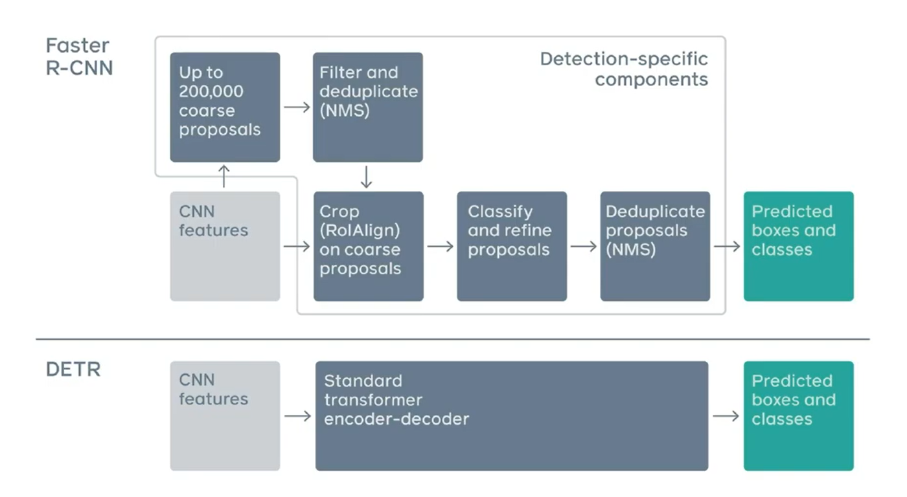

1. [Co-DETR](https://github.com/Sense-X/Co-DETR)

Co-DETR refers to DETRs with Collaborative Hybrid Assignments Training. So, in order to understand Co-DETR, go to understand DETR first.

1.1 DETR

1.2 Co-DETR

