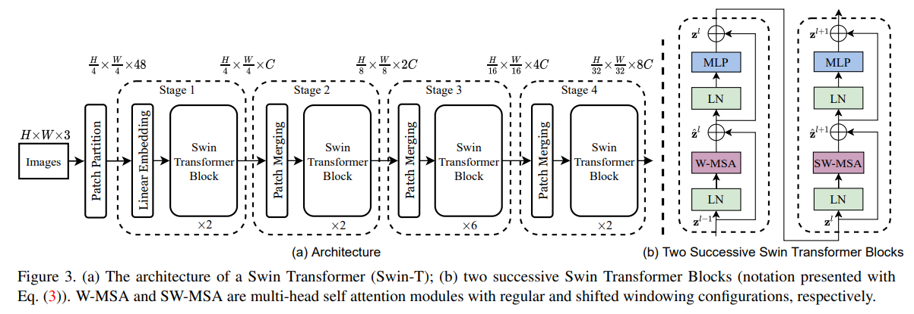
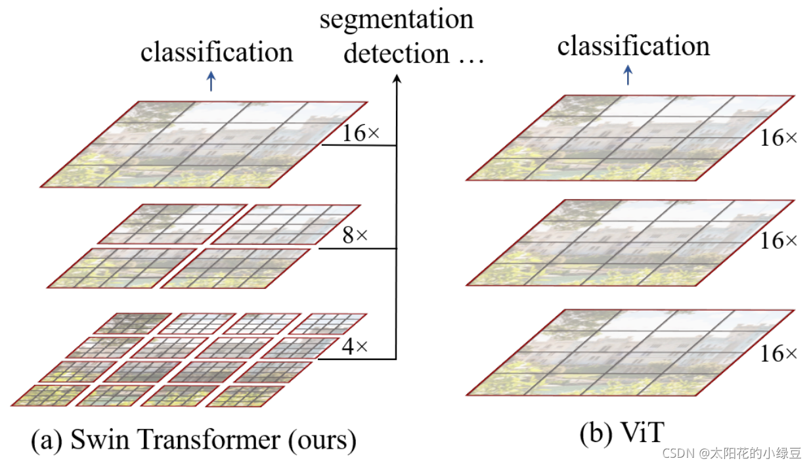

The Swin Transformer (Shifted Window Transformer) is a type of Vision Transformer designed to address some of the limitations of traditional Vision Transformers (ViTs) and compete effectively with Convolutional Neural Networks (CNNs) in computer vision tasks. 

Here’s a breakdown of what makes Swin Transformer unique and how it differs from CNN backbones:

### Key Features of Swin Transformer:
1. Hierarchical Feature Learning:
Swin Transformer introduces a hierarchical structure similar to CNNs. Instead of processing patches at a fixed size throughout the network, it creates different levels of feature maps with varying resolutions. This hierarchy allows it to capture both local and global information effectively.

2. Window-based Self-Attention:
- Unlike traditional Vision Transformers that apply self-attention globally across the entire image, Swin Transformer uses a window-based approach. It divides the image into non-overlapping windows and applies self-attention within each window. This reduces computational complexity compared to global self-attention.
- Windows are shifted between consecutive layers, allowing for cross-window interactions and enhancing the ability to capture context across window boundaries.

3. Shifted Windows:
To capture information across adjacent windows, Swin Transformer shifts the windows in alternate layers. This shifting mechanism helps aggregate information from neighboring windows and facilitates better feature integration.

4. Linear Computational Complexity:
By using window-based attention, Swin Transformer achieves linear computational complexity with respect to the image size, compared to the quadratic complexity of global self-attention in traditional Vision Transformers. This makes it more scalable to larger images.

5. Patch Merging Layers:
Swin Transformer incorporates patch merging layers that reduce the resolution of the feature maps while increasing their depth. This is similar to downsampling in CNNs and helps in building a multi-scale feature representation.

#### Q1. What is MLP?
The MLP block (Multi-Layer Perceptron block) is a fundamental component used in neural networks, including Vision Transformers (ViTs) and other transformer-based architectures. In the context of transformers, an MLP block typically refers to a sequence of fully connected (dense) layers that follow the self-attention mechanism in each transformer layer.

Here’s a detailed look at the MLP block:

#### Structure of an MLP Block
1. Input:
The input to the MLP block is typically the output of the self-attention mechanism (or sometimes the output of a previous MLP block, in deeper layers).

2. Fully Connected Layers:
- First Dense Layer: The input is passed through a dense (fully connected) layer with a nonlinear activation function (often GELU or ReLU). This layer transforms the input to a higher-dimensional space:

    Hidden1 = Activation(Input×𝑊1+𝑏1)

, where 𝑊1 and 𝑏1 are the weights and biases of the first dense layer, and Activation is a nonlinear activation function.

- Second Dense Layer: The output of the activation function is then passed through a second dense layer that projects it back to the original dimensionality:

    Output = Hidden1 × 𝑊2 + 𝑏2

where 𝑊2 and 𝑏2 are the weights and biases of the second dense layer.

3. Residual Connection and Layer Normalization:
- Residual Connection: The output of the MLP block is added to the original input of the MLP block. This residual connection helps with gradient flow and allows the network to retain some of the original information:

    MLP Output = LayerNorm(Input + Output)

- Layer Normalization: The result of adding the residual connection is then passed through layer normalization to stabilize the training and improve convergence.

#### Purpose of the MLP Block
1. Feature Transformation:
The MLP block applies a nonlinear transformation to the feature representations. This allows the model to learn complex patterns and interactions between features.

2. Dimensionality Adjustment:
The first dense layer typically increases the dimensionality of the feature space, enabling the model to capture more complex representations. The second dense layer then projects it back to the original dimensionality, which is useful for maintaining consistency in the model architecture.

3. Nonlinear Activation:
By applying a nonlinear activation function between the two dense layers, the MLP block introduces nonlinearity into the model, enhancing its capacity to learn complex mappings.

#### Example in Vision Transformers (ViTs) and Swin Transformers
- Vision Transformers: In a standard Vision Transformer, each transformer layer consists of a multi-head self-attention mechanism followed by an MLP block. The MLP block processes the output of the self-attention mechanism to further refine the feature representations.

- Swin Transformers: Similar to ViTs, Swin Transformers use MLP blocks after the window-based self-attention mechanism. The MLP block in Swin Transformers also includes a residual connection and layer normalization.

#### Summary
- Input: The output of the self-attention mechanism (or a previous MLP block).
- First Dense Layer: Projects the input to a higher-dimensional space with a nonlinear activation function.
- Second Dense Layer: Projects the output back to the original dimensionality.
- Residual Connection and Layer Normalization: Adds the original input to the MLP output and normalizes the result.

The MLP block enhances the expressive power of the model by allowing it to learn complex feature interactions and ensuring stable training through residual connections and layer normalization.

Reference
1. [https://blog.csdn.net/qq_37541097/article/details/121119988](https://blog.csdn.net/qq_37541097/article/details/121119988)